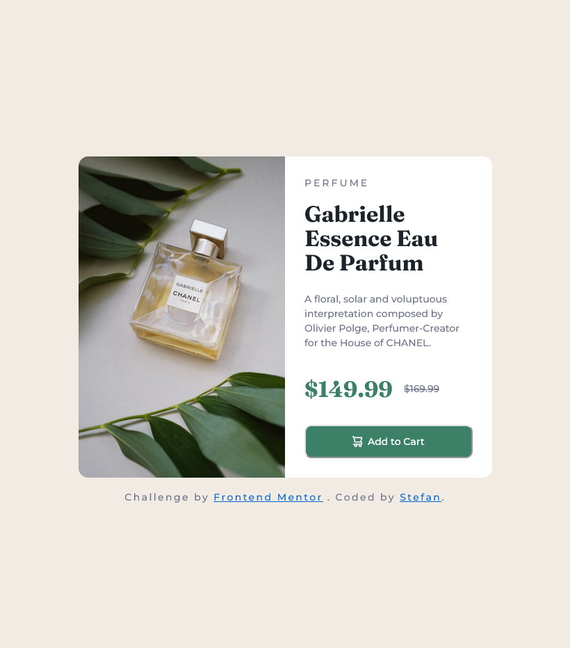

# Frontend Mentor - Product preview card component solution

This is a solution to the [Product preview card component challenge on Frontend Mentor](https://www.frontendmentor.io/challenges/product-preview-card-component-GO7UmttRfa). Frontend Mentor challenges help you improve your coding skills by building realistic projects.

## Table of contents

- [Overview](#overview)
  - [The challenge](#the-challenge)
  - [Screenshot](#screenshot)
  - [Links](#links)
- [My process](#my-process)
  - [Built with](#built-with)
  - [What I learned](#what-i-learned)
  - [Useful resources](#useful-resources)

## Overview

### The challenge

Users should be able to:

- View the optimal layout depending on their device's screen size
- See hover and focus states for interactive elements

### Screenshot



### Links

- Solution URL: [Add solution URL here](https://your-solution-url.com)
- Live Site URL: [Add live site URL here](https://your-live-site-url.com)

## My process

### Built with

- Semantic HTML5 markup
- CSS custom properties
- Flexbox
- Mobile-first workflow
- ARIA

### What I learned

```html
<!-- Using the visually-hidden class, aswell as aligning the prices neatly -->
<div class="product-price-container">
  <p class="product-price" aria-label="Current price">
    <span class="visually-hidden">Current price:</span>
    $149.99
  </p>
  <p class="product-old-price" aria-label="Original price">
    <span class="visually-hidden">Original price:</span>
    <s>$169.99</s>
  </p>
</div>
```

```css
/* Might change this style in the future, as it would get too big for large projects */
:root {
  /* ! Do not use these directly */
  --_color-primary:                 hsl(0, 0%, 100%);
  --_color-secondary:               hsl(212, 21%, 14%);
  --_color-tertiary:                hsl(158, 36%, 37%);
  --_color-quaternary:              hsl(228, 12%, 48%);
  --_color-quinary:                 hsl(30, 38%, 92%);

  --color-button-background:        var(--_color-tertiary);
  --color-button-active-background: var(--_color-secondary);
  --color-button-text:              var(--_color-primary);
  --color-price-label:              var(--_color-tertiary);
  --color-price-old:                var(--_color-quaternary);
  --color-body-text:                var(--_color-quaternary);
  --color-heading-text:             var(--_color-secondary);
  --color-page-background:          var(--_color-quinary);
  --color-product-background:       var(--_color-primary);
  --color-attribution-text:         var(--_color-primary);
  --color-attribution-background:   var(--_color-secondary);

  --font-family-primary:    "Montserrat", sans-serif;
  --font-family-accent:     "Fraunces", serif;

  --font-family-body:     var(--font-family-primary);
  --font-family-heading:  var(--font-family-accent);
  --font-family-price:    var(--font-family-accent);

  --font-weight-regular:  500;
  --font-weight-bold:     700;

  --font-size-body:       0.875rem; /* 14px */
  --font-size-heading:    2rem; /* 32px */

  --product-mobile-width: 23.4375rem; /* 375px */

  /* Centers content of the body, the card in this case. */
  min-height: 100vh;
  align-items: center;
  justify-content: center;

  /* Previously i used this to Center vertically and horizontally,
  however this broke the right part of the card on desktop(height mismatch between left and right side), likely caused by the way flexbox handles paddings and margins. I switched my method of centering here to body due to this. */
  .product-container {
    display: flex;
    justify-content: center;
    align-items: center;

    min-height: 100vh;
    margin-inline: auto;
  }
}
```

### Useful resources

- [ChatGPT](https://chat.openai.com/chat) - Helped me figure out how to put the cart icon to the left of the button text, also helped me pick CSS custom property names(for me this was the hardest part - the naming of CSS variables).
- [YouTube - Kewin Powell](https://www.youtube.com/watch?v=B2WL6KkqhLQ) - Taught me a better way of aligning the prices part, aswell as the visually-hidden class, my previous solution to this was lacking.
